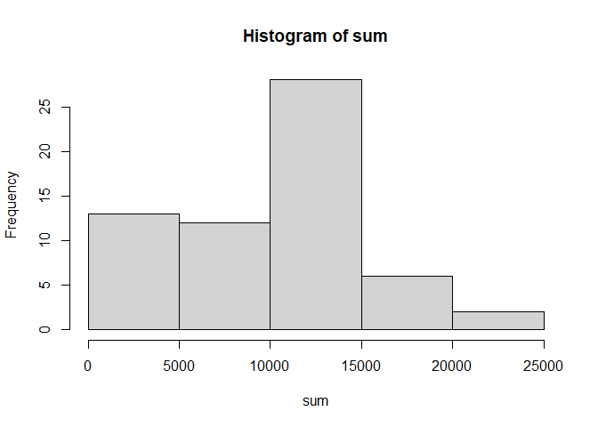
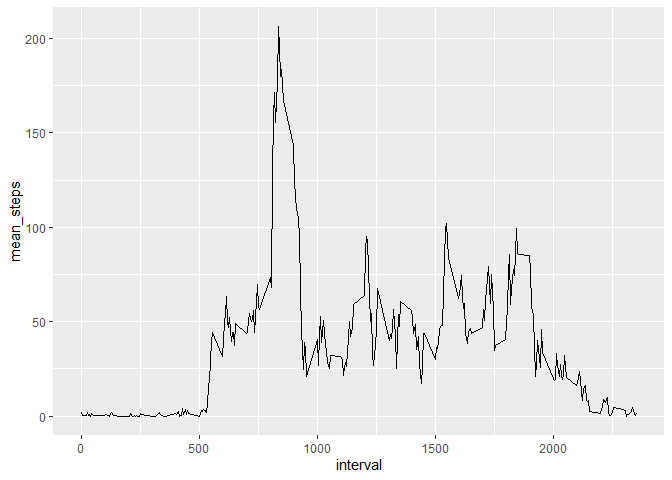
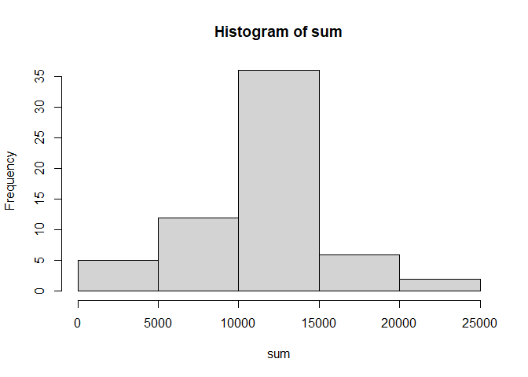
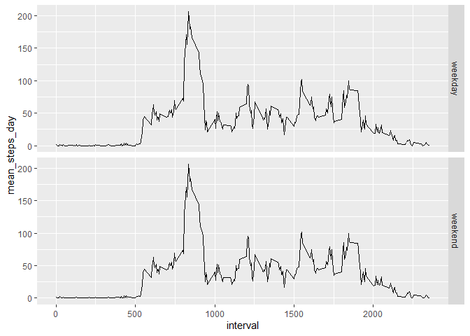

## Loading and preprocessing the data
Read the csv file and convert the column date from class character to date


```r
library(tidyverse)
```

```
## -- Attaching packages ------------------------------------------- tidyverse 1.3.0 --
```

```
## v ggplot2 3.3.2     v purrr   0.3.4
## v tibble  3.0.1     v dplyr   1.0.0
## v tidyr   1.1.0     v stringr 1.4.0
## v readr   1.3.1     v forcats 0.5.0
```

```
## -- Conflicts ---------------------------------------------- tidyverse_conflicts() --
## x dplyr::filter() masks stats::filter()
## x dplyr::lag()    masks stats::lag()
```

```r
library(simputation)
library(knitr)
data<-read.csv("activity.csv" , sep = ",")
data$date<-as.Date(data$date, format = "%Y-%m-%d")  
```
## What is mean total number of steps taken per day?


```r
stepspday<-data%>%group_by(date)%>%summarise(mean=mean(steps,na.rm = T), median=median(steps, na.rm = T),sum=sum(steps,na.rm = T))
```

```
## `summarise()` ungrouping output (override with `.groups` argument)
```

```r
meansteps<-mean(stepspday$sum, na.rm = T)
meansteps
```

```
## [1] 9354.23
```

```r
mediansteps<-median(stepspday$sum, na.rm = T)
mediansteps
```

```
## [1] 10395
```


```r
with(stepspday, hist(sum) )
```

<!-- -->

## What is the average daily activity pattern?


```r
timeseries<-data%>%group_by(interval)%>%summarize(mean_steps=mean(steps, na.rm = T))
```

```
## `summarise()` ungrouping output (override with `.groups` argument)
```

```r
timeseries%>%ggplot(aes(interval, mean_steps)) + geom_line()
```

<!-- -->

The 5-minute interval that, on average, contains the maximum number of steps is:

```r
maxsteps<-which.max(timeseries$mean_steps)
timeseries[maxsteps,1]
```

```
## Warning: `...` is not empty.
## 
## We detected these problematic arguments:
## * `needs_dots`
## 
## These dots only exist to allow future extensions and should be empty.
## Did you misspecify an argument?
```

```
## # A tibble: 1 x 1
##   interval
##      <int>
## 1      835
```

## Imputing missing values
##Code to describe and show a strategy for imputing missing data


Downloaded the package simputation and found the function impute_proxy
Method: imputation by a group mean, calculates the mean of each group (interval ) and replaces the NA within each group with the mean

```r
summary(data)
```

```
##      steps             date               interval     
##  Min.   :  0.00   Min.   :2012-10-01   Min.   :   0.0  
##  1st Qu.:  0.00   1st Qu.:2012-10-16   1st Qu.: 588.8  
##  Median :  0.00   Median :2012-10-31   Median :1177.5  
##  Mean   : 37.38   Mean   :2012-10-31   Mean   :1177.5  
##  3rd Qu.: 12.00   3rd Qu.:2012-11-15   3rd Qu.:1766.2  
##  Max.   :806.00   Max.   :2012-11-30   Max.   :2355.0  
##  NA's   :2304
```

```r
datanew<-impute_proxy(dat = data,formula = steps~mean(steps,na.rm = T)| interval)
summary(datanew)
```

```
##      steps             date               interval     
##  Min.   :  0.00   Min.   :2012-10-01   Min.   :   0.0  
##  1st Qu.:  0.00   1st Qu.:2012-10-16   1st Qu.: 588.8  
##  Median :  0.00   Median :2012-10-31   Median :1177.5  
##  Mean   : 37.38   Mean   :2012-10-31   Mean   :1177.5  
##  3rd Qu.: 27.00   3rd Qu.:2012-11-15   3rd Qu.:1766.2  
##  Max.   :806.00   Max.   :2012-11-30   Max.   :2355.0
```

##Histogram of the total number of steps taken each day after missing values are imputed

```r
data1<-datanew%>%group_by(date)%>%summarise(mean=mean(steps,na.rm = T), median=median(steps, na.rm = T),sum=sum(steps,na.rm = T))
```

```
## `summarise()` ungrouping output (override with `.groups` argument)
```

```r
with(data1, hist(sum) )
```

<!-- -->

```r
meanstepsnona<-mean(data1$sum)
meanstepsnona
```

```
## [1] 10766.19
```

```r
medianstepsnona<-median(data1$sum)
medianstepsnona
```

```
## [1] 10766.19
```


## Are there differences in activity patterns between weekdays and weekends?

```r
data2<-datanew%>%mutate (day = weekdays(date) )
data2<-data2%>%mutate(dayw=ifelse(day %in% c("sábado", "domingo"), "weekend", "weekday"))

data3<-data2%>%group_by(interval)%>%summarise(interval,mean_steps_day=mean(steps),dayw)
```

```
## `summarise()` regrouping output by 'interval' (override with `.groups` argument)
```

```r
data3%>%ggplot(aes(interval, mean_steps_day)) +geom_line()+facet_grid(dayw~.)
```

<!-- -->
